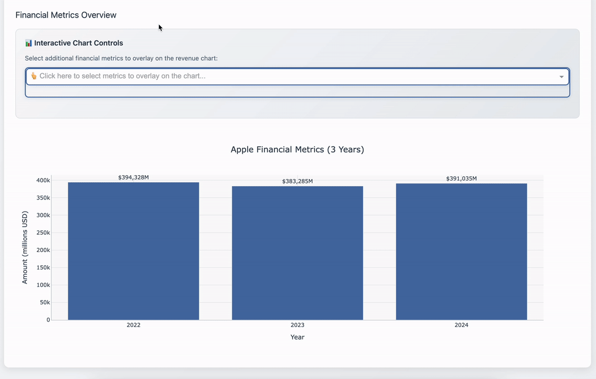

  <h1>Guillermo Ibanez | Dashboard Sample</h1>
  <h1></h1>

  <h2>📋 Summary</h2>
  

    <ul>
      <li>This Repository is set up to display some of my Dashboard capabilities using Python. Find below a visual summary of the dashboard tools as well as the links to open the dashboard on your web browser. This Dashboard has been deployed using both AWS Amazon Lightsail and Render. The links are at the end of this README file.</li>
    </ul>
  

  <h2> Apple Inc. Financial Analysis Dashboard</h2>
      <ul>
      <li>This Dashboard uses the raw annual financial results of Apple Inc. (10k document) in xls. format. The Dashboard allows a quick and visual exploration of the results.</li>
    </ul>
  
  <!-- General Overview Section -->
  <h3><strong>📊 General Overview</strong></h3>
  

    
  

  
  <!-- Interactive Dropdown Section -->
  <h3><strong>🎛️ Interactive Financial Metrics Dropdown Menu</strong></h3>
  

    
  

  
  <!-- Pie Chart and Map Section -->
  <h3><strong>🗺️ Interactive Pie Chart and Map</strong></h3>
  

    
  

  
  <!-- Data Tables Section -->
  <h3><strong>📋 Interactive Financial Documents Tables</strong></h3>
  

    
  

  </ul>
    <li>Click this link to check out the dashboard on your web browser: 
  http://18.196.82.106:8000/</li>
</ul>
  <h2>Deployment using AWS Amazon Lightsail.</h2>
<ul>
    <h2>Deployment using Render.</h2>
  <li>Click this link to check out the dashboard on your web browser (might take a couple of minutes to charge): 
  <a href="https://project-dashboards-2.onrender.com" target="_blank">https://project-dashboards-2.onrender.com</a></li>
<ul>
